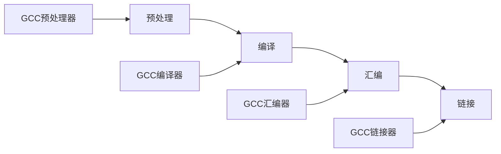

## 程序编译过程
```shell
gcc HelloWorld.c -o HelloWorld
```
上面的代码用于使用gcc来编译代码

### **流程图如下**：


> 1. `gcc HelloWorld.c -E -o HelloWorld.i` 预处理：加入头文件，替换宏
> 2. `gcc HelloWorld.c -S -c -o HelloWorld.s`  编译：包括与处理，将C程序转换成汇编程序
> 3. `gcc HelloWorld.c -c -o HelloWorld.i`  汇编: 包含预处理和编译，将汇编程序转换为可链接的二进制程序
> 4. `gcc HelloWorld.c -E -o HelloWorld.i`  链接：包含上述所有操作，将可连接的二进制程序和其他库链接在一起，形成可执行文件

### 程序装载执行

***图灵机***：一个抽象的模型，有一个无限长的纸带，纸带上有无限个小格子，小格子中写有相关的信息，纸带上有一个读头，读头能根据小格子里的信息做相关的操作并来回移动。

![[图灵机.jpg]]

***冯诺依曼结构***：
- 实现的功能 
	1. 把程序和数据装入到计算机中；
	2. 必须具有长期记住程序、数据的中间结果及最终运算结果；
	3. 完成各种算术、逻辑运算和数据传送等数据加工处理；
	4. 根据需要控制程序走向，并能根据指令控制机器的各部件协调操作；
	5. 能够按照要求将处理的数据结果显示给用户。
- 为了完成上述的功能，计算机必须具备五大基本组成部件：
	1. 装载数据和程序的输入设备；
	2. 记住程序和数据的存储器；
	3. 完成数据加工处理的运算器；
	4. 控制程序执行的控制器；
	5. 显示处理结果的输出设备
